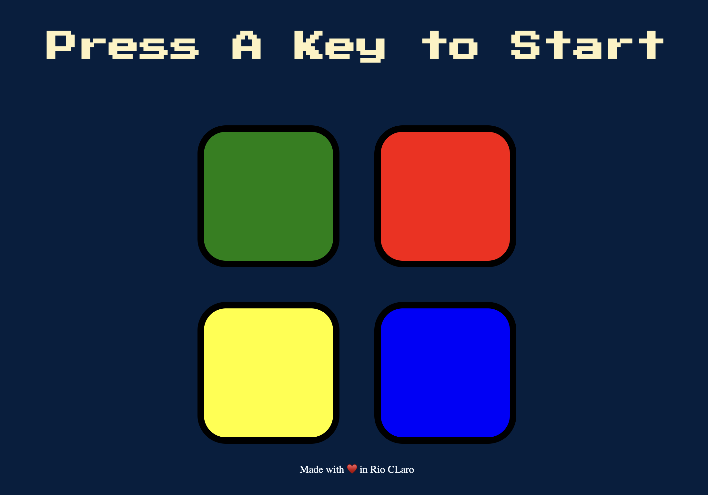

# Simon Game

A browser-based implementation of the classic Simon memory game. The player must repeat an increasingly long sequence of colors and sounds. Each successful round adds a new step to the sequence, making the game progressively more challenging.

## Features

- Random sequence generation
- Interactive color and sound effects
- Level progression system
- Game over detection and restart functionality
- Responsive user interaction

## Technologies

- HTML5
- CSS3
- JavaScript (ES6)
- jQuery

## How to Play

1. Press any key to start the game.
2. Watch the highlighted color sequence.
3. Repeat the sequence by clicking the buttons in the correct order.
4. Each level adds a new color to the pattern.
5. The game ends when an incorrect button is selected.

## Learning Objectives

This project was developed to practice:

- DOM manipulation
- Event handling
- Arrays and sequence management
- JavaScript logic and control flow
- Audio integration
- Front-end development fundamentals

## Project Status

Completed as part of my JavaScript learning journey.

## Simon Game

